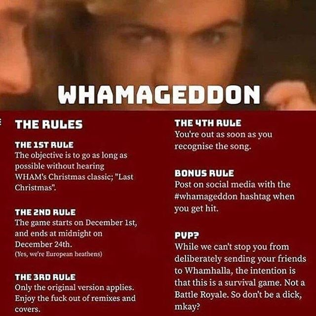

# Whamageddon Bot

A very silly Discord bot to wind people up.

This bot unabashedly breaks the PVP rule.

## Installation instructions

1. Set up a Python 3.8 virtual environment.
1. Install the dependencies to this environment with `pip install -r requirements.txt`. Some extra required dependencies may be needed - see the discord.py library installation instructions [here](https://discordpy.readthedocs.io/en/latest/intro.html#installing).
1. Set the video you wish to download in the variable `VIDEO` in `get_wham.py`, and run this to download the video to `./videos/`.
1. Copy this video relative filepath and add it to a `.env` file, e.g. `VIDEO_FILE=youtube-bwNV7TAWN3M-Wham_-_Last_Christmas_Official_4K_Video.webm`
1. Create a Discord bot with the voice permissions Connect and Speak.
1. Add the bot token to the `.env` file as the env variable `TOKEN`.
1. Invite the bot to your Discord server.
1. Run `python wham.py`.
1. Type `!wham my-voice-channel` in a text channel on the server, where `my-voice-channel` is the name of the voice channel to Wham.
1. 🎅

## Links

- https://discordpy.readthedocs.io/en/latest/faq.html
- https://discord.com/developers/docs/reference
- https://github.com/Rapptz/discord.py/blob/master/examples/basic_voice.py
